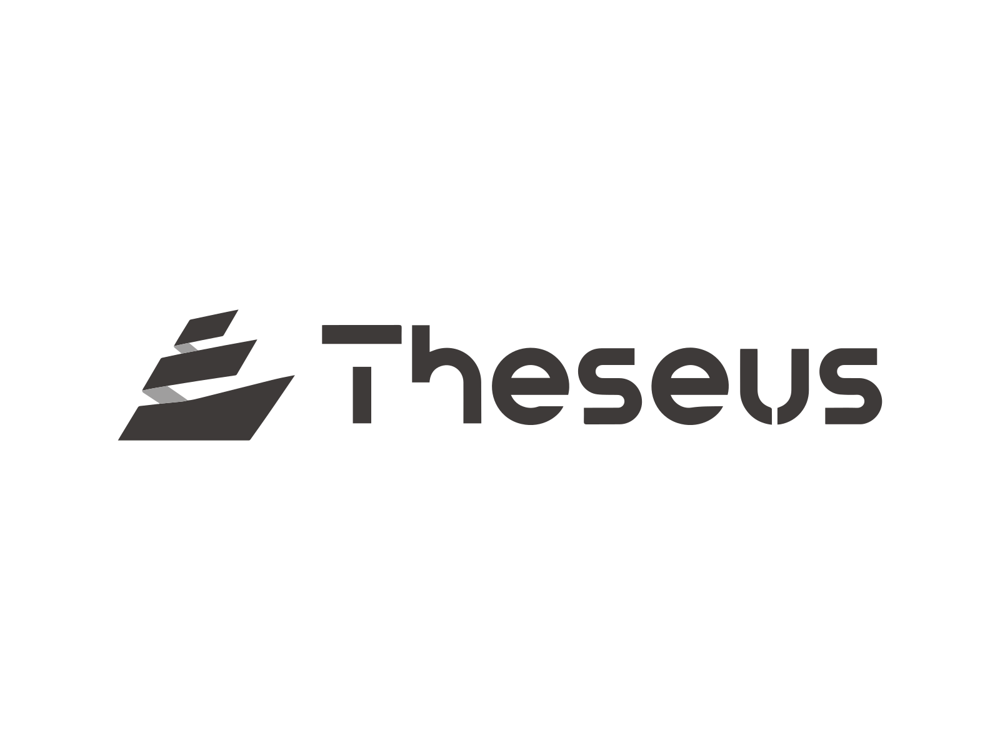
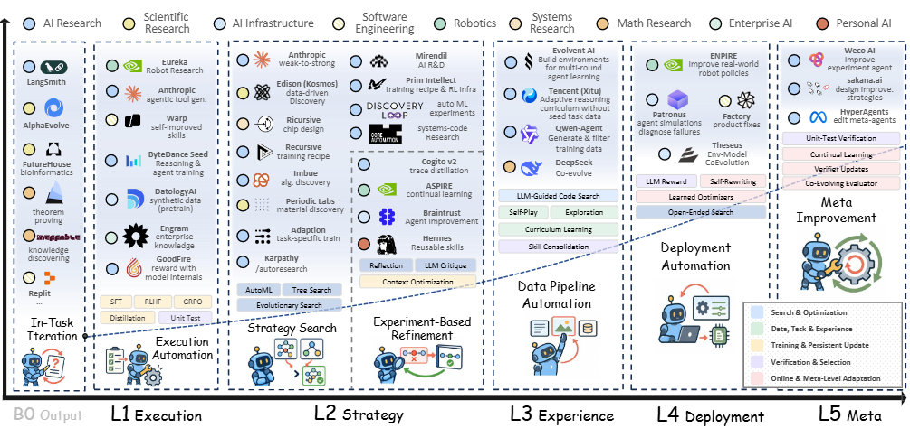

<div align="center">
  
</div>

<div align="center">
  <h3>Building intelligence that can evolve.</h3>
  <p>
    Theseus Lab studies AI systems that learn from experience, revise their
    strategies, and improve through verifiable feedback.
  </p>
</div>

<div align="center">
  <a href="https://theseus-labs-rsi.github.io/">
    
  </a>
  <a href="https://arxiv.org/abs/2609.11873">
    
  </a>
  <a href="https://github.com/theseus-labs-rsi">
    
  </a>
</div>

## 📰 News

- **[September 11, 2026]** The Theseus Lab website is now live.
- **[September 10, 2026]** Our survey on genuine recursive self-improvement was released on arXiv.

## 👋 About Theseus Lab

Theseus Lab explores **recursive intelligence systems**: AI systems that can
turn experience and feedback into persistent improvements—not only in what they
can do, but also in how they improve next.

Our current work follows the path from execution-level adaptation to genuine
recursive self-improvement. We are especially interested in:

- improvement-execution and improvement-strategy autonomy;
- experience acquisition and environment adaptation;
- persistent, testable changes to models, agents, and their surrounding systems;
- evaluation methods that distinguish temporary performance gains from durable improvement;
- recursive meta-improvement and the safety of long-horizon self-evolution.

## 🔎 Featured Report

### The Last AI Built by Humans: Toward Genuine Recursive Self-Improvement

Our survey organizes the rapidly growing RSI landscape and traces a development
roadmap from execution autonomy and strategy autonomy to experience acquisition,
environment adaptation, and recursive meta-improvement.

It connects research across scientific discovery, embodied intelligence,
software engineering, and other domains, while identifying the capability gaps
that still separate current systems from genuine RSI.

<div align="center">
  <a href="https://arxiv.org/abs/2609.11873">
    
  </a>
</div>

Key contributions include:

- a unified view of RSI research across systems, tasks, and update targets;
- an analysis of current development trends and unresolved research loops;
- a long-horizon evolution map spanning **L1 Execution**, **L2 Strategy**,
  **L3 Experience**, **L4 Deployment**, and **L5 Meta-improvement**;
- a practical connection between academic RSI research and emerging real-world systems.

**Paper:** [arXiv:2609.11873](https://arxiv.org/abs/2609.11873)  
**Project page:** [theseus-labs-rsi.github.io](https://theseus-labs-rsi.github.io/)

## 🧭 Research and Updates

The website serves as the public index for Theseus Lab. New research projects,
technical reports, and lab notes will be added as they become ready. Each project
can have its own focused page while sharing the same visual and editorial system.

The current release intentionally includes open project slots so that lab members
can publish upcoming work without redesigning the homepage.

## 🌐 Website

This repository contains the public Theseus Lab website. It is built with
**React**, **TypeScript**, and **Vite**, and is deployed automatically through
**GitHub Pages**.

For maintainers, research listings are defined in
[`src/data/research.ts`](src/data/research.ts). Every push to `main` triggers the
deployment workflow.

```bash
npm install
npm run dev
```

### Design preview at `/testa/`

The Claude-inspired design is available at
[`https://theseus-labs-rsi.github.io/testa/`](https://theseus-labs-rsi.github.io/testa/).
The existing homepage remains at `/`. Both pages share research records and
public assets; the preview's components and styles live in `src/testa/`.

Run `npm run dev` and open `/testa/` to edit the preview. Run `npm run build`
followed by `npm run preview` to check the production output. Vite builds both
`index.html` and `testa/index.html` into `dist/`, so the existing Pages workflow
publishes both paths together when the PR is merged into `main`.

Keep the trailing slash on `/testa/` links. Report navigation uses hash routes,
for example `/testa/#/research/rsi-survey-2026`; assets are shared from
`../brand/` and `../research/` relative to the preview page.

## 📬 Follow the Work

- Visit the [Theseus Lab website](https://theseus-labs-rsi.github.io/)
- Explore the [Theseus Lab GitHub organization](https://github.com/theseus-labs-rsi)
- Read the [featured RSI report](https://arxiv.org/abs/2609.11873)

---

<div align="center">
  <sub>Theseus Lab · Systems that improve how they improve.</sub>
</div>


### Design preview at `/testb/`

The Hunyuan-inspired design is available at [Theseus Lab /testb/](https://theseus-labs-rsi.github.io/testb/). It includes the dashed logo with waves, research detail pages, and scrolling sample community comments. The homepage and `/testa/` retain their existing designs.

Run `npm run dev` and open `/testb/`. Source files live in `src/testb/`; Vite builds `testb/index.html` alongside the existing pages. Public assets use `../brand/` and `../research/`. Use the trailing slash, including for hash routes such as `/testb/#/research/rsi-survey-2026`.
